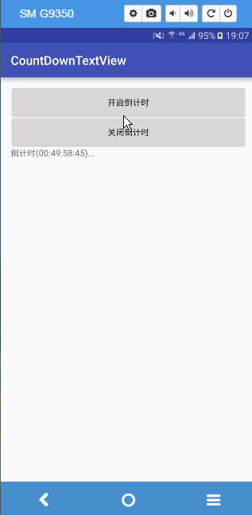
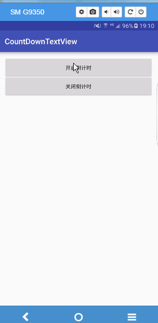

##效果图

##如何实现
实现原理其实很简单,Android里有倒计时的api,就是CountDownTimer.只需要继承它,然后实现两个方法,就可以实现倒计时了

	/**
	 * 继承 CountDownTimer 方法
	 *
	 * 重写 父类的方法 onTick() 、 onFinish()
	 */

    class MyCountDownTimer
            extends CountDownTimer
    {
        /**
         *
         * @param millisInFuture
         *      表示以毫秒为单位 倒计时的总数
         *
         *      例如 millisInFuture=1000 表示1秒
         *
         * @param countDownInterval
         *      表示 间隔 多少毫秒 调用一次 onTick 方法
         *
         *      例如: countDownInterval =1000 ; 表示每1000毫秒调用一次onTick()
         *
         */
        public MyCountDownTimer(long millisInFuture, long countDownInterval) {
            super(millisInFuture, countDownInterval);
        }

        @Override
        public void onFinish() {
            mTv.setText("计时完毕,做你想做的事");

        }
        //分秒位
        private int mm=99;

        @Override
        public void onTick(long millisUntilFinished) {
            Log.i("MainActivity", millisUntilFinished + "");
            //            mTv.setText("倒计时(" + millisUntilFinished / 1000 + ")...");
            mm--;
            if (mm<=0){
                mm=99;
            }
            mTv.setText("倒计时(" + getStandardTime(millisUntilFinished/1000) +":"+mm+ ")...");
        }
    }